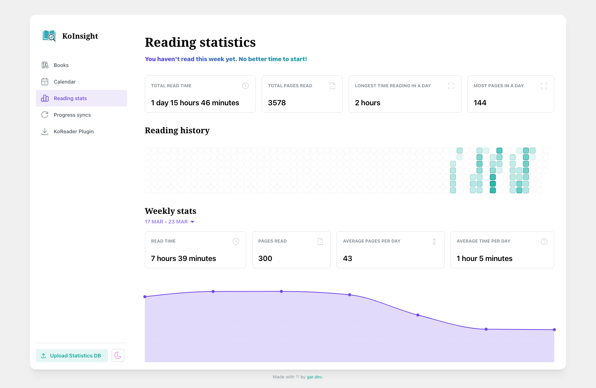
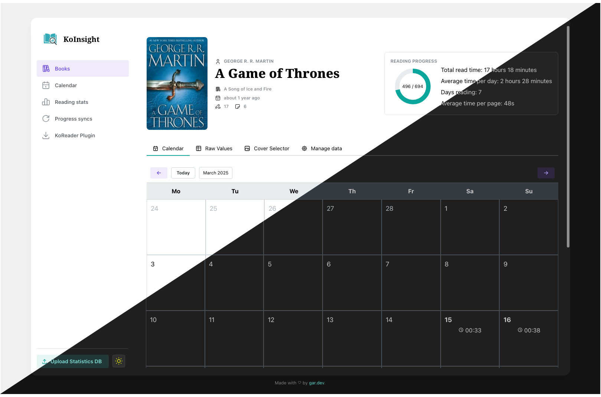
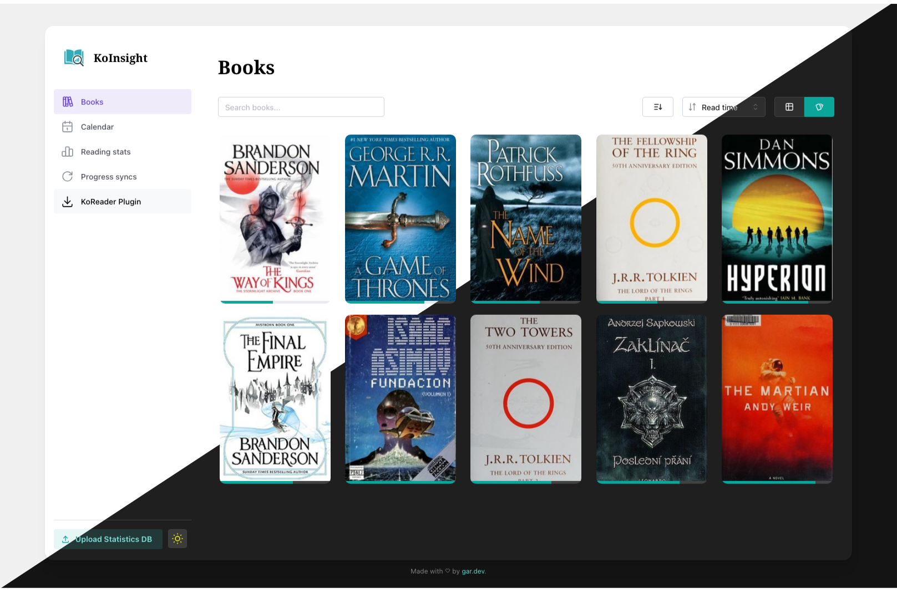
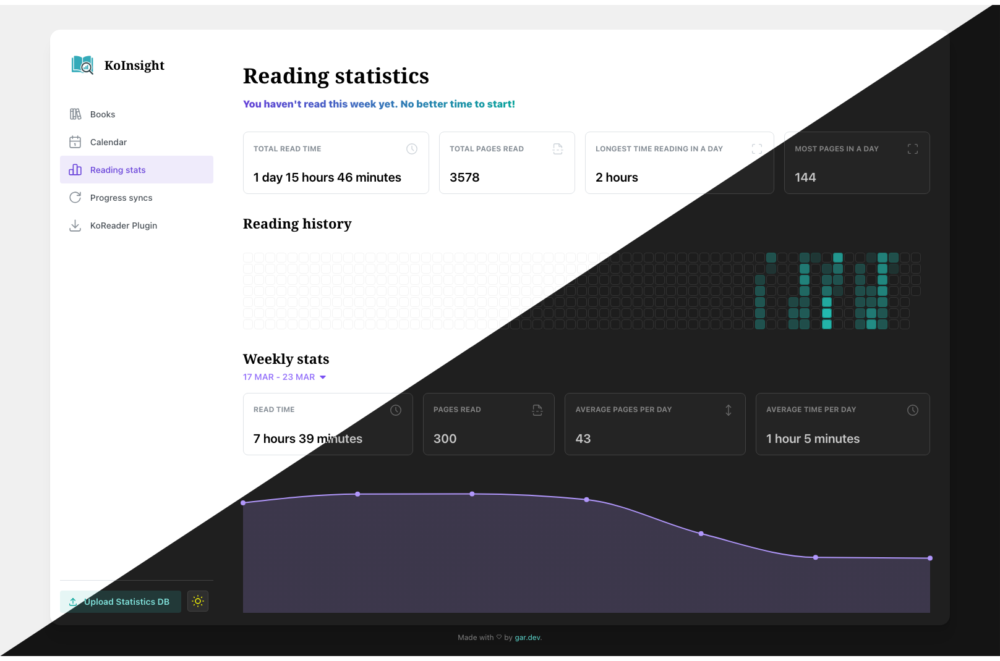
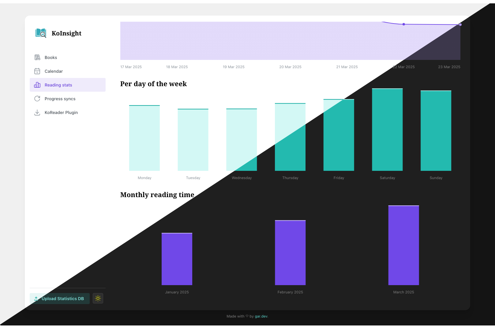

<p align="center">
  <picture>
    <source media="(prefers-color-scheme: dark)" srcset="images/heading.png">
    
  </picture>
</p>

<p align="center">
  <strong>KoInsight</strong> brings your <a href="https://koreader.rocks" target="_blank">KOReader</a> reading stats to life with a clean, web-based dashboard.
</p>

<p align="center">
  <a href='https://coveralls.io/github/GeorgeSG/KoInsight'></a>
</p>

<p align="center">
   <picture>
    <source media="(prefers-color-scheme: dark)" srcset="images/screenshots/stats_1_d.png">
    
  </picture>
</p>

# Features

- 📈 Interactive dashboard with charts and insights
- 🔄 KOReader plugin for syncing reading stats
- 📱 Multi-device support
- 📤 Manual .sqlite upload supported
- ♻️ Act as a KOReader (kosync) sync server
- 🏠 Fully self-hostable (Docker image available)

# Screenshots
<table>
  <tr>
    <td><strong>Home page</strong></td>
    <td><strong>Book view</strong></td>
  </tr>
  <tr>
    <td></td>
    <td></td>
  </tr>
  <tr>
    <td><strong>Statistics</strong></td>
    <td><strong>Statistics</strong></td>
  </tr>
  <tr>
    <td></td>
    <td></td>
  </tr>
</table>

See all [screenshots](/images/screenshots/)


# Installation
Using [Docker](https://docker.com) and [Docker Compose](https://docs.docker.com/compose/)

Add the following to your `compose.yaml` file:

```yaml
name: koinsight
services:
  koinsight:
    image: ghcr.io/georgesg/koinsight:latest
    restart: unless-stopped
    ports:
      - "3000:3000"
    volumes:
      - ./data:/app/data
```
Run `docker compose up -d`.

# Usage

## Reading statistics

To start seeing data in KoInsight, you need to upload your reading statistics.
Currently, there are two ways to do this:

1. **Manual upload**: Extract your `statistics.sqlite` file from KOReader and upload it using the **"Upload Statistics DB"** button in KoInsight.
2. **Sync plugin**: Install and configure the KoInsight plugin in KOReader to sync your data directly.

### KOReader sync plugin
The KoInsight plugin syncs your reading statistics from KOReader to KoInsight.

**Installation:**
1. Download the plugin ZIP bundle from the **"KOReader Plugin"** button in the main menu.
1. Extract it into your `KOReader/plugins/` folder.
1. For the plugin to be installed correctly, the file structure should look like this:
    ```
    koreader
    └── plugins
        └── koinsight.koplugin
            ├── _meta.lua
            ├── main.lua
            └── ...
    ```

**Usage:**
1. Open the KOReader app.
1. Go to the **Tools** menu and open **KoInsight** (it should be below "More tools").
1. Click **Configure KoInsight** and enter your KoInsight server URL (e.g., `http://server-ip:3000`).
    - ⚠️ Make sure your KOReader device has network access to the server.
1. Click **Sync** in the KoInsight plugin menu.

Reload the KoInsight web dashboard. If everything went well (🤞), your data should appear.

### Manual Upload: `statistics.sqlite`
1. Open a file manager on your KOReader device.
1. Navigate to the `KOReader/settings/` folder.
1. Locate the `statistics.sqlite` file.
1. Copy it to your computer.
1. Upload it to KoInsight using the **"Upload Statistics DB"** button.
1. Reload the KoInsight web dashboard.

Every time you need to reupload data, you would need to upload the statistics database file again.

## Use as progress sync server

You can use your KoInsight instance as a KOReader sync server. This allows you to sync your reading progress across multiple devices.

1. Open the KOReader app.
1. Go to the **Tools** menu and open **Progress sync**
1. Set the server URL to your KoInsight instance (e.g., `http://server-ip:3000`).
1. Register an account and login.
1. Sync your progress.

The progress sync data should appear in the **"Progress syncs"** page in KoInsight.

# Roadmap
(a.k.a things I want to do)

See [Project board](https://github.com/users/GeorgeSG/projects/2)
